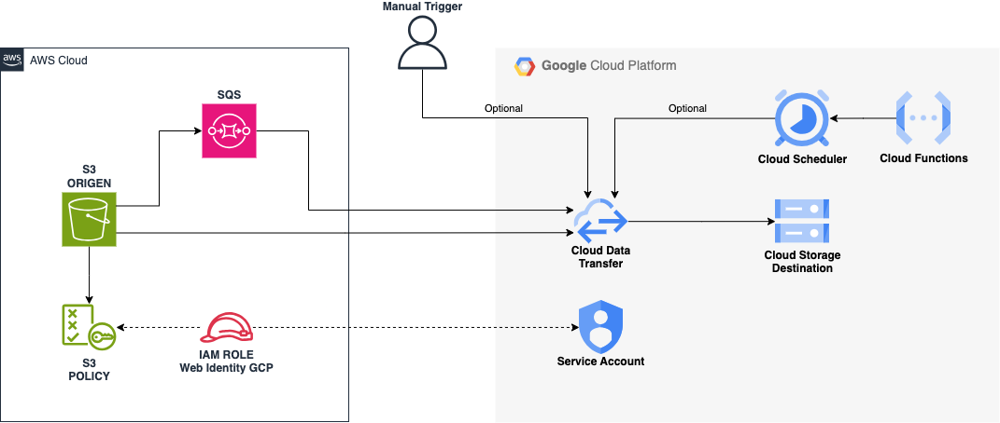

# S3 to GCP Replica - Event-Driven Demo

This repository contains a demo for replicating data from an AWS S3 bucket to a GCP Cloud Storage bucket using Terraform and an event-driven workflow.

---

## 🚀 Features

- **Data replication between AWS S3 and GCP Cloud Storage.**
- **Infrastructure management using Terraform.**
- **Automation through a simple and effective `Makefile`.**
- **Cost report generation with Infracost.**

---
## Diagram

## 📂 Folder Structure

The repository structure is designed to simplify infrastructure organization and management:

