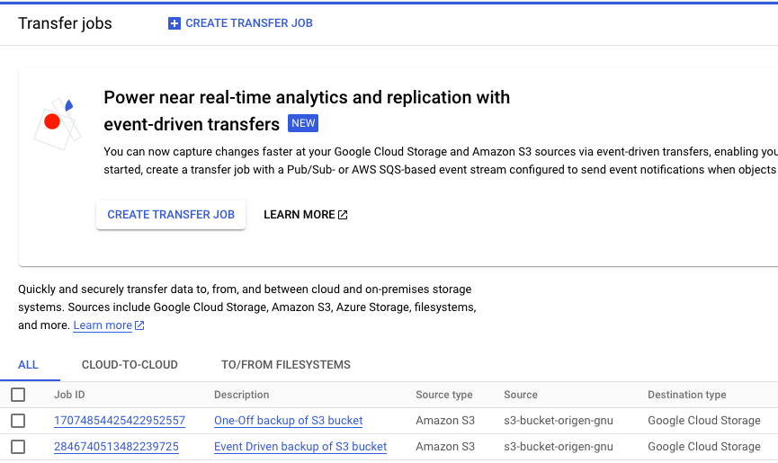
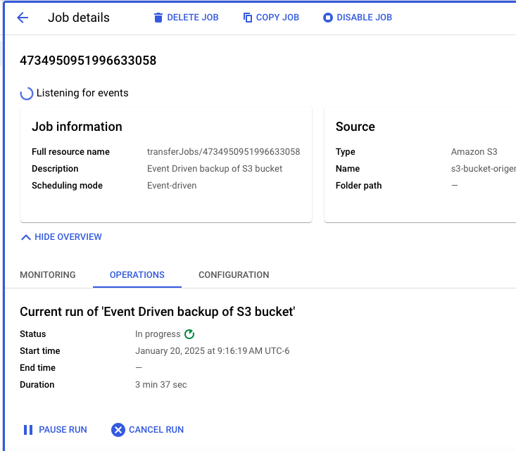

# S3 to GCP Replica - Event-Driven Demo

This repository contains a demo for replicating data from an AWS S3 bucket to a GCP Cloud Storage bucket using Terraform and an event-driven workflow.

---

## 🚀 Features

- **Data replication between AWS S3 and GCP Cloud Storage.**
- **Infrastructure management using Terraform.**
- **Automation through a simple and effective `Makefile`.**
- **Cost report generation with Infracost.**

---
## Diagram


## 📂 Folder Structure

The repository structure is designed to simplify infrastructure organization and management:

```bash
├── 01-aws-s3-origen.tf
├── 02-gcp-storage.tf
├── Makefile
├── README.md
├── drawio
│   ├── s3-to-gcp.drawio
│   └── s3-to-gcp.drawio.png
├── main.tf
├── outputs.tf
├── provider.tf
├── s3-objects
├── terraform.tfvars
└── variables.tf
```
---

## 🛠️ Using the `Makefile`

The `Makefile` simplifies working with Terraform and GCP. Ensure you are on macOS with the required tools installed.

### 📋 Prerequisites

1. **Terraform:** Install from [Terraform CLI](https://www.terraform.io/downloads).
2. **gcloud CLI:** Install from [Google Cloud CLI](https://cloud.google.com/sdk/docs/install).
3. **Infracost (optional):** Install with `brew install infracost`.

### 📝 Global Variables

- `REGION`: Defines the region for resources (`us-central1` by default).

### 🔧 Available Commands

1. **Log in to GCP:**
   ```bash
   make login
   ```

### 🌟 Additional Notes
- AWS Authentication: Use a preconfigured aws profile.
- GCP Authentication: Already done via gcloud auth application-default login.

### Future Improvements:
Integrate CI/CD pipelines for automated deployments.
Add scripts to validate data replication.

# 📂 Evidence and Screenshots

This section contains visual evidence and screenshots to validate the implementation and functionality of the project.





## 🤝 **Let's Connect!**

If you find this repository useful and want to see more content like this, follow me on LinkedIn to stay updated on more projects and resources!

[](https://www.linkedin.com/in/franconavarro/)

If you’d like to support my work, you can buy me a coffee. Thank you for your support!

[](https://www.buymeacoffee.com/francotel)